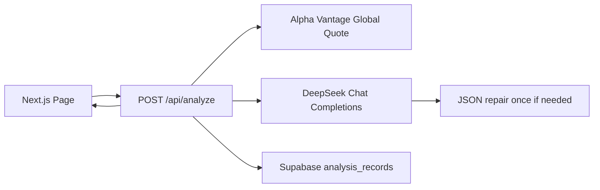

# AI 股票分析面板

一个全栈 MVP：输入股票代码，后端获取 Alpha Vantage 当前行情，调用 DeepSeek 输出严格 JSON 分析，并把行情与分析结果保存到 Supabase。

## 功能

- 单页输入股票代码，例如 `AAPL`
- `POST /api/analyze` 服务端调用 Alpha Vantage Global Quote
- DeepSeek 返回严格 JSON：`summary`、`sentiment`、`risk_level`
- 首次 LLM JSON 解析失败时，自动请求 DeepSeek 修复一次
- 保存 `symbol`、`quote_json`、`ai_json` 到 Supabase
- 页面展示行情摘要、AI 分析、保存状态和错误提示

## 架构



主要文件：

- `app/page.tsx`：单页工具 UI
- `app/api/analyze/route.ts`：Next.js Route Handler
- `src/lib/alpha-vantage.ts`：行情获取
- `src/lib/deepseek.ts`：DeepSeek 分析与 JSON 修复
- `src/lib/supabase.ts`：保存分析记录
- `src/lib/analyze-service.ts`：流程编排和 symbol 校验

## 环境变量

复制 `.env.example` 为 `.env.local`，填入：

```env
ALPHA_VANTAGE_API_KEY=
DEEPSEEK_API_KEY=
SUPABASE_URL=
SUPABASE_SERVICE_ROLE_KEY=
```


## Supabase schema

也可直接执行 `supabase/schema.sql`。

```sql
create extension if not exists "pgcrypto";

create table if not exists public.analysis_records (
  id uuid primary key default gen_random_uuid(),
  symbol text not null,
  quote_json jsonb not null,
  ai_json jsonb not null,
  created_at timestamptz default now()
);
```

## API

`POST /api/analyze`

请求：

```json
{
  "symbol": "AAPL"
}
```

成功响应：

```json
{
  "symbol": "AAPL",
  "quote": {},
  "analysis": {
    "summary": "...",
    "sentiment": "Neutral",
    "risk_level": "Medium"
  },
  "saved": true
}
```

错误响应：

```json
{
  "error": {
    "code": "ALPHA_VANTAGE_ERROR",
    "message": "Alpha Vantage returned no quote for this symbol."
  }
}
```

支持错误码：

- `MISSING_SYMBOL`
- `ALPHA_VANTAGE_ERROR`
- `DEEPSEEK_ERROR`
- `INVALID_LLM_JSON`
- `SUPABASE_SAVE_ERROR`

## DeepSeek Prompt

首次分析：

```text
You are a cautious stock analyst. Return only strict JSON. No markdown, no commentary.

Analyze the current Global Quote for {SYMBOL}.
Use only the quote data provided; do not invent financial metrics.
Return exactly this JSON shape:
{"summary":"string","sentiment":"Bullish | Neutral | Bearish","risk_level":"Low | Medium | High"}
Quote JSON:
{QUOTE_JSON}
```

修复请求：

```text
You repair invalid model output into strict JSON only. No markdown, no commentary.

Repair the previous output for {SYMBOL} into valid JSON that matches the required schema.
Required schema:
{"summary":"string","sentiment":"Bullish | Neutral | Bearish","risk_level":"Low | Medium | High"}
Original quote JSON:
{QUOTE_JSON}
Invalid output:
{INVALID_OUTPUT}
```

当前模型：`deepseek-v4-flash`，请求中使用 `response_format: { "type": "json_object" }`，并设置 `thinking: { "type": "disabled" }`。

## 本地运行

```bash
npm install
npm run dev
```

打开 `http://localhost:3000`。

## 验证

```bash
npm test
npm run typecheck
npm run build
```

当前自动化测试覆盖：

- symbol trim、uppercase、空输入、非法字符
- Alpha Vantage Global Quote 参数和空行情错误
- DeepSeek 首次 JSON 失败后的修复重试
- DeepSeek 修复仍失败时返回 `INVALID_LLM_JSON`
- Supabase 保存失败映射为 `SUPABASE_SAVE_ERROR`

## 手动测试清单

- 正常股票：输入 `AAPL`，应展示行情、summary、sentiment、risk_level，保存状态为已保存
- 空输入：清空输入提交，应显示 `MISSING_SYMBOL`
- 无效股票：输入不存在的代码，应显示 `ALPHA_VANTAGE_ERROR`
- LLM JSON 解析失败：自动化测试 `src/lib/deepseek.test.ts` 已模拟首次失败并验证修复；真实手动可临时把 `parseAnalysisJson` 前的 first-pass mock 改成非 JSON 后运行测试
- Supabase 保存失败：临时移除 `SUPABASE_SERVICE_ROLE_KEY` 或填错表名，应显示 `SUPABASE_SAVE_ERROR`

## Render 部署

1. 把代码推到 GitHub。
2. Render 创建 Web Service，连接 GitHub 仓库。
3. Build Command：`npm ci && npm run build`
4. Start Command：`npm run start`
5. 添加环境变量：`ALPHA_VANTAGE_API_KEY`、`DEEPSEEK_API_KEY`、`SUPABASE_URL`、`SUPABASE_SERVICE_ROLE_KEY`
6. 部署后访问 Render URL，测试 `AAPL`。

## Debug 记录

- `npm test` 初次失败：测试引用的生产模块还未创建，符合 TDD 红灯预期
- 补齐服务端模块后：`npm test` 通过，13 条测试绿灯
- `npm run typecheck` 初次失败：`app/page.tsx` 中 API 响应类型收窄不够明确
- 添加 `isApiErrorResponse` type guard 后：`npm run typecheck` 通过
- `npm run build` 通过，路由包含静态 `/` 和动态 `/api/analyze`

## 已知限制

- 不包含登录、历史记录、watchlist、图表或批量分析
- Alpha Vantage 免费层可能限频；限频会映射为 `ALPHA_VANTAGE_ERROR`
- AI 输出只是行情摘要，不构成投资建议

## 参考文档

- [Next.js Route Handlers](https://nextjs.org/docs/app/getting-started/route-handlers)
- [Alpha Vantage Global Quote](https://www.alphavantage.co/documentation/#latestprice)
- [DeepSeek Chat Completion API](https://api-docs.deepseek.com/api/create-chat-completion)
- [Supabase JavaScript insert](https://supabase.com/docs/reference/javascript/insert)
